# Purushoth's Portfolio

Hey there! I'm Purushoth, a backend engineer passionate about building scalable systems and AI-driven applications. I specialize in backend development with FastAPI, databases, and cloud services, with a strong focus on AI integration, distributed systems, and efficiency.

Check out my live portfolio: [https://purushoth-backend-portfolio.netlify.app](https://purushoth-backend-portfolio.netlify.app)

---


## Featured Projects

### Level Up - Fitness Studio Companion App
*Fitness tracking made simple for Level Up Fitness Studio.*

- **What It Does**: A full-stack gym app where admins manage workouts and diets while users (~100 active) log their fitness journey.
- **Stack**: FastAPI, Flutter, MongoDB, Firebase, JWT Auth, Google Cloud Storage
- **Highlights**: 99.9% uptime, real-time workout tracking (~300+ logs daily), smooth user experience.
- **GitHub**: [github.com/purushothdl/level-up](https://github.com/purushothdl/level-up) 
- **Screenshots**:
<table>
  <tr>
    <td width="33%">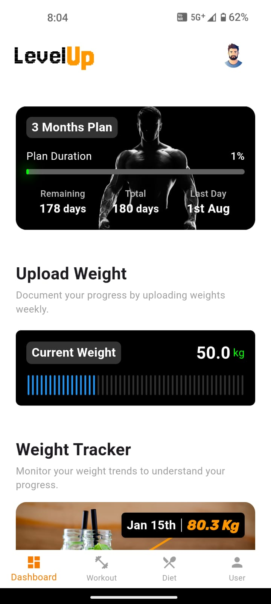</td>
    <td width="33%">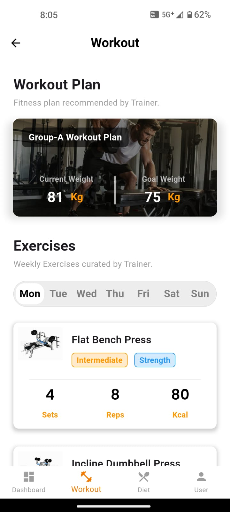</td>
    <td width="33%">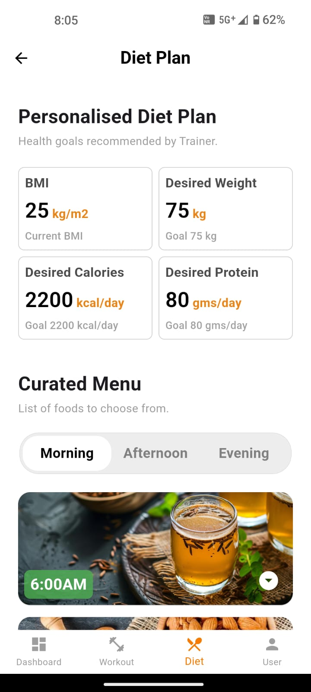</td>
  </tr>
  <tr>
    <td width="33%">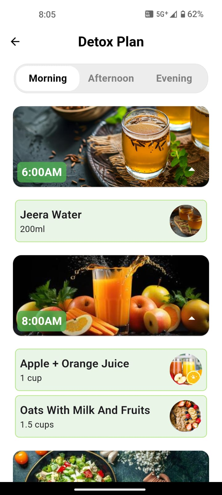</td>
    <td width="33%">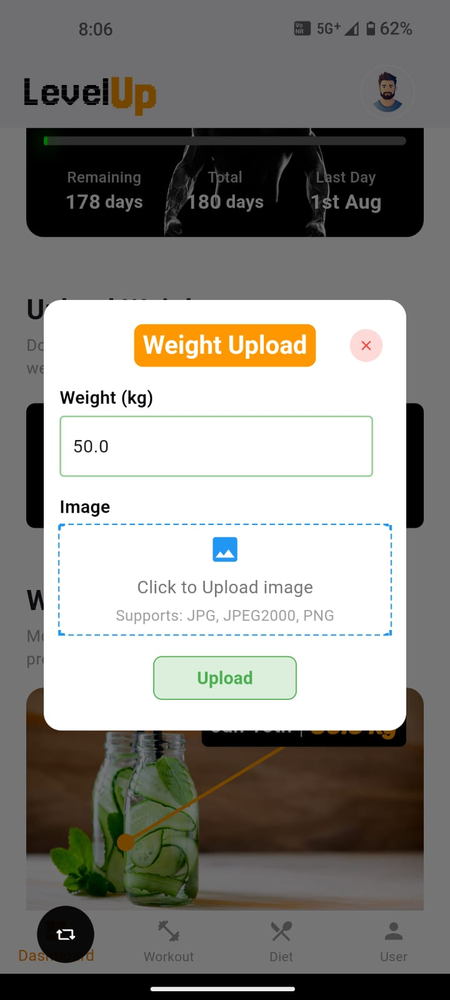</td>
  </tr>
</table>

### NextGenHealth - AI-Enhanced Telemedicine Prototype
*Streamlining healthcare with AI.*

- **What It Does**: Patients submit tickets (symptoms, images, reports), admins assign them, and AI provides preliminary insights.
- **Stack**: FastAPI, Flutter, MongoDB, Gemini AI, Firebase Cloud Messaging, Google Cloud Storage
- **Highlights**: <3s chat latency, tested with 50+ cases, optimized real-time updates.
- **GitHub**: [github.com/purushothdl/nextgenhealth](https://github.com/purushothdl/nextgenhealth)  
- **Screenshot**:  
<table>
  <tr>
    <td width="33%"></td>
    <td width="33%"></td>
    <td width="33%"></td>
  </tr>
  <tr>
    <td width="33%"></td>
    <td width="33%"></td>
  </tr>
</table>
    
### GreenCore - Smart Waste Management Solution
*Eco-friendly waste disposal with AI & location tracking.*

- **What It Does**: Users drop off waste at locations within a 50m radius, AI classifies materials, and disposal trends are tracked.
- **Stack**: FastAPI, Flutter, Google Maps SDK, Gemini AI, MongoDB, JWT Auth
- **Highlights**: 80+ AI classifications, interactive weight tracking, smart location mapping.
- **GitHub**: [github.com/purushothdl/greencore](https://github.com/purushothdl/green-core) 
- **Screenshots**:  
<table>
  <tr>
    <td width="33%">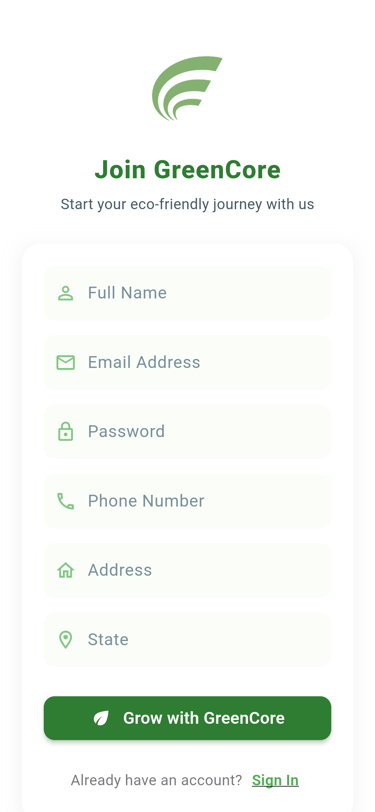</td>
    <td width="33%">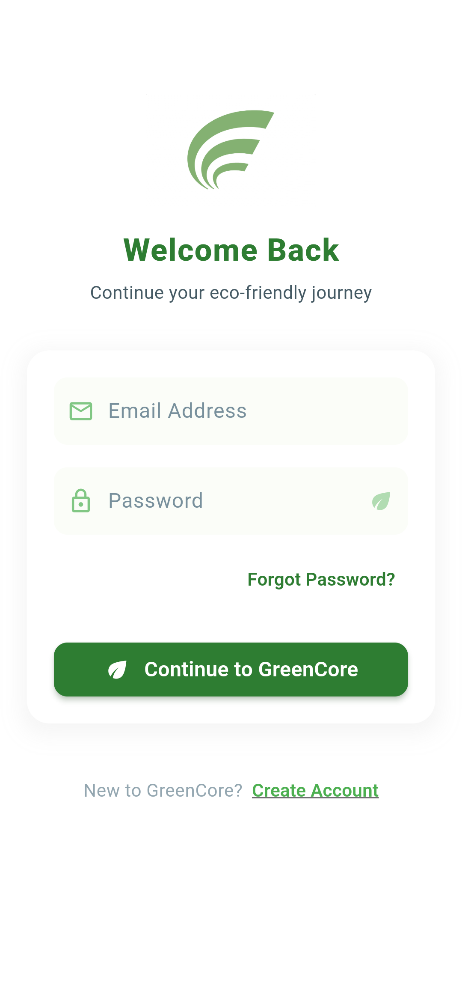</td>
    <td width="33%">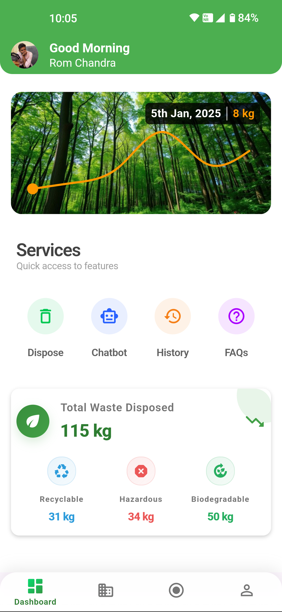</td>
  </tr>
  <tr>
    <td width="33%">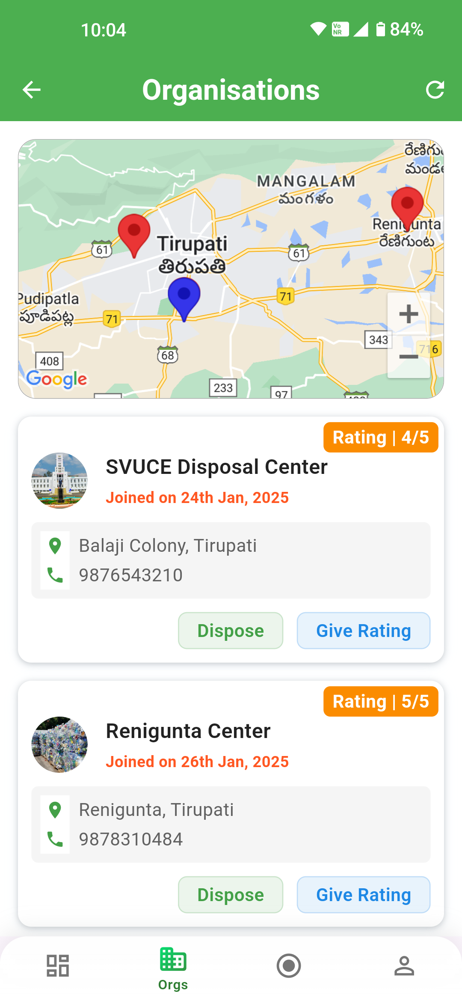</td>
    <td width="33%">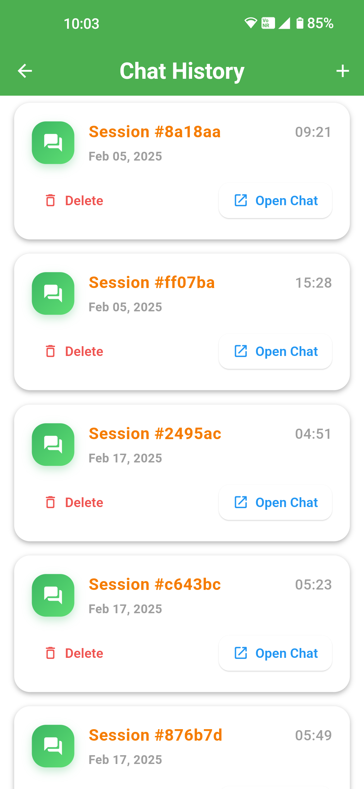</td>
    <td width="33%">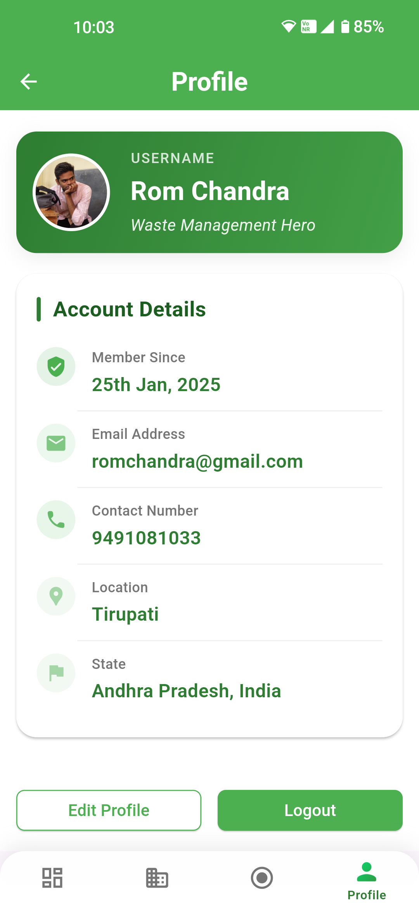</td>
  </tr>
  <tr>
    <td width="33%">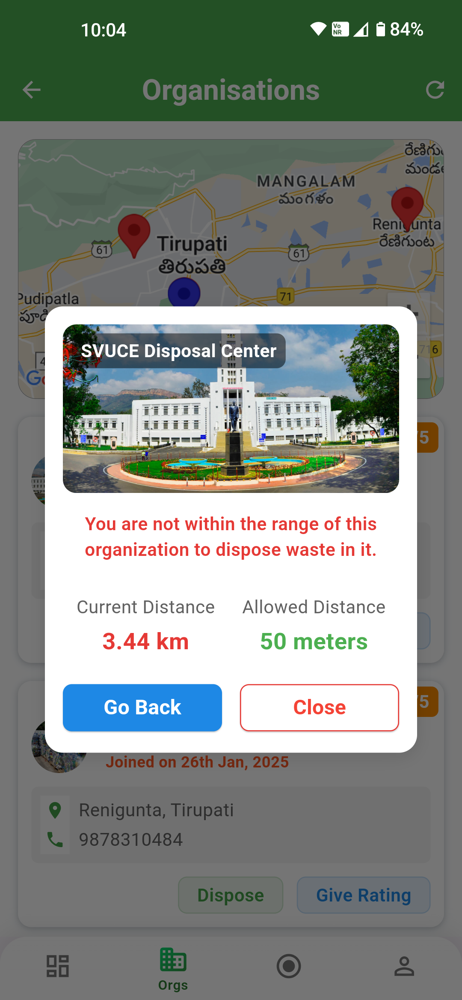</td>
    <td width="33%">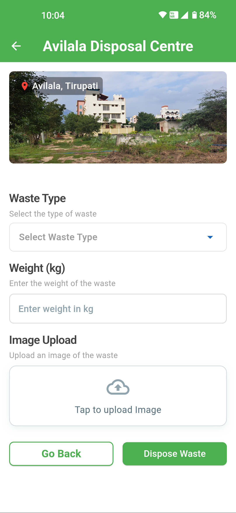</td>
    <td width="33%">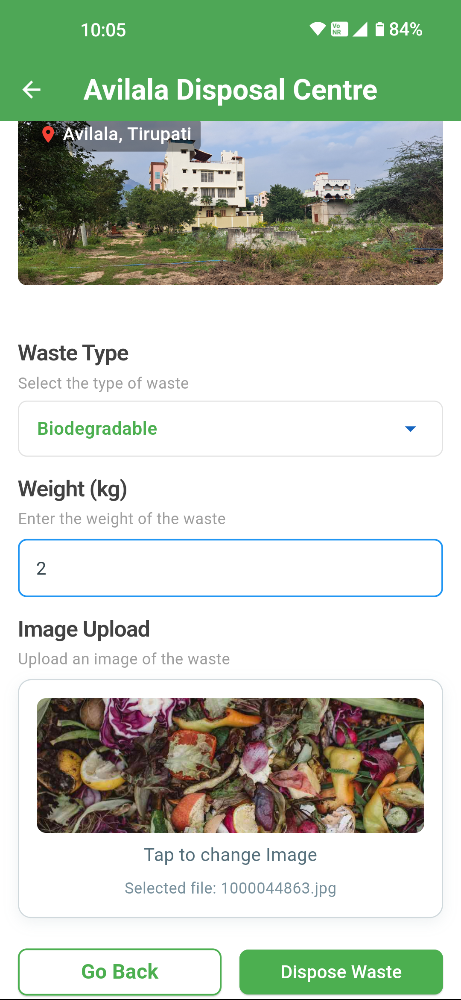</td>
  </tr>
  <tr>
    <td width="33%">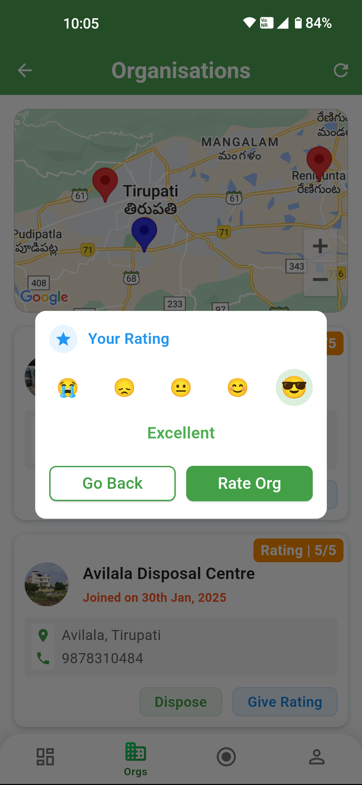</td>
    <td width="33%">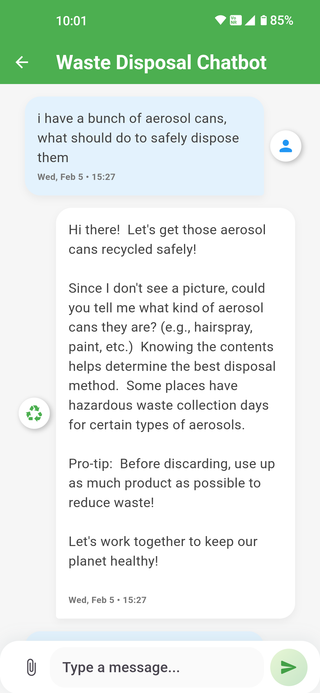</td>
    <td width="33%">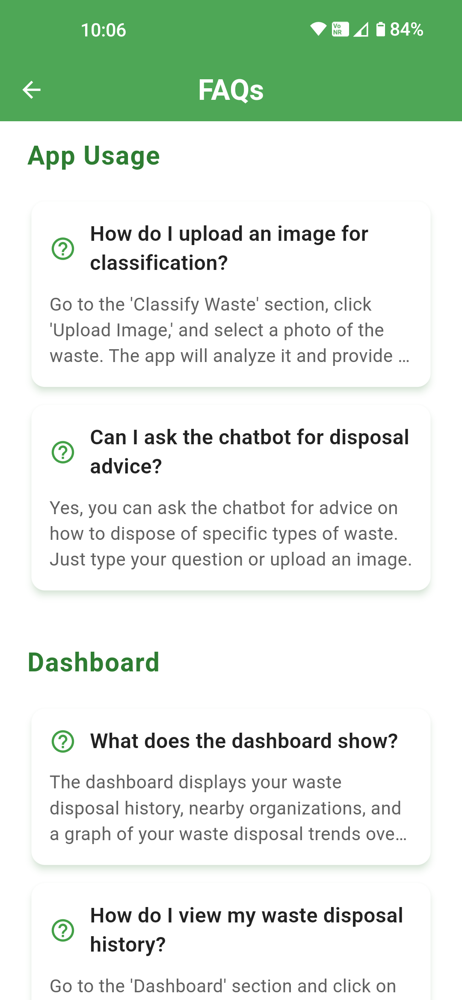</td>
  </tr>
</table>

---

## Technical Skills

### Backend & Databases
- **FastAPI, Python** (Efficient API design, WebSockets, JWT Auth)
- **MongoDB** (Optimization, pipelines, aggregations)
- **SQL** (PostgreSQL, SQLite, query optimization)
- **Firebase** (Firestore, Cloud Messaging, Authentication)

### Frontend & UI
- **Flutter** (Cross-platform mobile apps, state management, custom widgets)
- **Streamlit** (Data visualization dashboards, rapid prototyping)
- **Dart** (Flutter app architecture, state management patterns)

### AI & Data Engineering
- **Retrieval-Augmented Generation (RAG)** (Pinecone, Neo4j for Graph RAG)
- **Vertex AI** (Multimodal RAG with PDFs & images)
- **Computer Vision** (YOLO object detection, OpenCV streaming)

### Cloud & DevOps
- **Google Cloud** (Vertex AI, Maps SDK, embeddings, storage)
- **AWS** (ECR, ECS, Fargate for containerized apps)
- **Docker** (Microservices, deployment automation)

---

## Experimental Work
Aside from structured projects, I’ve explored:
- **Live-streamed video processing**: Streaming phone footage to the web via an IP camera app and applying YOLO object detection in real time.
- **Graph RAG & Multimodal RAG**: Leveraging Neo4j for knowledge graphs and integrating images/PDFs into AI pipelines using Vertex AI.

These were self-driven learning experiences rather than full-fledged applications but strengthened my grasp of AI-driven backend systems.

---

## About Me
I’m all about backend engineering, with a focus on AI-enhanced applications. I love designing efficient APIs, integrating AI workflows, and optimizing data pipelines. Always exploring new tech to push boundaries.

- **Vibe**: Building scalable, intelligent systems that just work.
- **Connect**: [LinkedIn](https://www.linkedin.com/in/dl-purushoth-b2a5a52a7/) | [GitHub](https://github.com/purushothdl) 
---


## Setup & Run
Want to check out my work? Here's how:

### Clone the repository
```bash
git clone https://github.com/purushothdl/portfolio
```

### Install dependencies
```bash
npm install
```

### Start development server
```bash
npm run dev
```

### Build for production
```bash
npm run build
```

## Thanks for Stopping By!
This portfolio is constantly evolving—more projects, more experiments, more learning. Feel free to reach out for collaborations or tech discussions!

*Last Updated: February 28, 2025*
